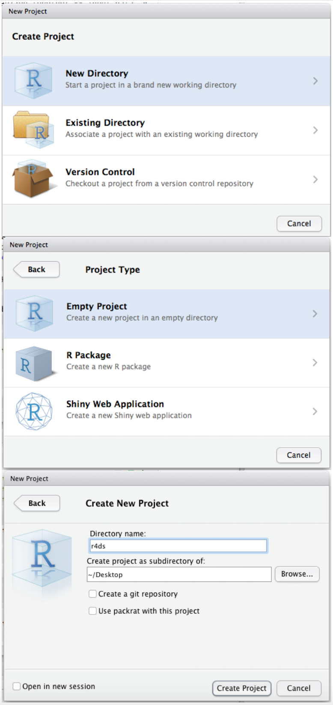
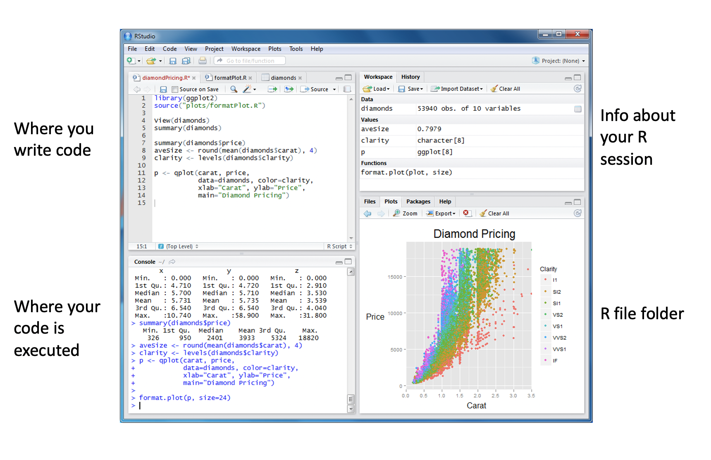
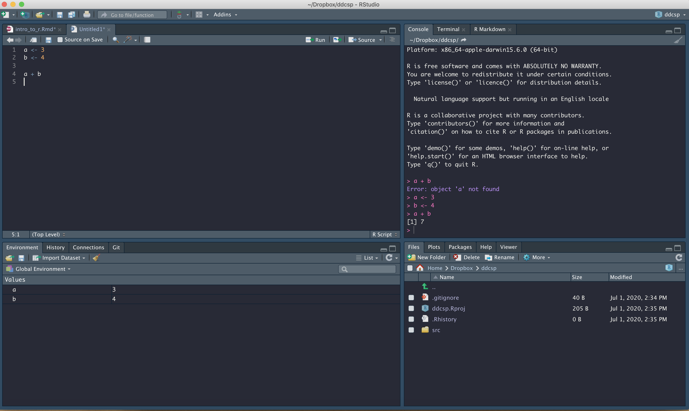

```{r setup, include=FALSE}
knitr::opts_chunk$set(echo = TRUE,
                      warning = FALSE,
                      message = FALSE)
```

### 1. Resources

R for Data Science:
https://r4ds.had.co.nz

R cheatsheets: https://rstudio.com/resources/cheatsheets/

Base R cheatsheet: https://rstudio.com/wp-content/uploads/2016/10/r-cheat-sheet-3.pdf

ggplot cheatsheet:
https://rstudio.com/wp-content/uploads/2015/03/ggplot2-cheatsheet.pdf

### 2. Create an R Project

https://r4ds.had.co.nz/workflow-projects.html

**8.4 RStudio projects**

R experts keep all the files associated with a project together — input data, R scripts, analytical results, figures. This is such a wise and common practice that RStudio has built-in support for this via projects.

Let’s make a project for you to use while you’re working through the rest of this book. Click File > New Project, then:

{width=500px}

A project is an entity that contains:

- It's own set of data
- It's own set of analyses
- It's own set of unique products (figures, documents, etc.)

Create a new project every time you start a new project

- Give it a unique name that is informative
- Make sure it is going into the right subdirectory

### 3. R Studio

A quick orientation to your R studio windows:



A more detailed orientation to R Studio:


### 4. R script

You should create a new R Script every time you are working on a new task within your project. Think about the R script as a word document that you can write in, edit, save, then open later to work on again. To open up an R script go to New File > R Script.

A new window will open up called "Untitled1"

Type this code into your R script:

```{r, eval = F}
a <- 3
b <- 4

a + b
```

What happened when you pressed enter after `a + b`? Did you get this error message: "Error: object 'a' not found"?

Why didn't it work? If you just pressed enter after each line, you just went to a new line of your code. In order for R to know what "a" and "b" are, you need to execute this code so that R knows that you are assigning the value "3" to the variable "a" and the value "4" to the variable "b." 

To execute your code, put your cursor back on the first line or highlight "a <- 3" and press command + enter (mac) or control + enter (windows). Do the same for "b <- 4" and "a + b." Now what happened? You should have gotten an output in your console that "a + b" equals 7. 




Look at your R environment. Before you executed your code, this window should have been empty but now after executing your code, you have two new variables, a and b. R will save these values in your environment for each working session, which means that later on in your code if you refer to "a" again, R will remember that "a = 3." However, if you close your R script or R project, it will not save your environment unless you tell it to. In general, it's good practice not to save any information between working sessions but rather to start fresh. There are two reasons for this. First, in your next session, you may start working in a new R script and you may want to assign "a" to a new value. Second, your code should always be 100% reproducible. For example, if you call "a + b" without first assigning "a" in this code, then you should get the error message "Error: object 'a' not found" to remind you that you need to assign "a" a value.

Sometimes you may want to clear your environment within a session, particularly if you're switching from working on one R script to another. You can do so with this command:

```{r, eval = FALSE}
remove(list = ls())
```

### 4. Plotting

Okay, now let's do something fun. Let's make a plot!!!

First we need some data. R has a number of datasets already loaded that you can access. You can find a description of them here: https://stat.ethz.ch/R-manual/R-devel/library/datasets/html/00Index.html

A really popular dataset is called "iris" and contains measurements on flower sepal length, sepal width, petal length, and petal width for several species of flower.

Let's take a quick look at these data. There are several ways to do this:


Option 1: Call the data

```{r}
iris
```

Option 2: See just the first 5 rows of the data

```{r}
head(iris)
```

or first 20 rows

```{r}
head(iris, 10)
```

or last 20 rows:

```{r}
tail(iris, 20)
```


Option 3: View entire dataset in a separate window

```{r, eval = FALSE}
View(iris)
```

Here's a quick checklist about what you should look at whenever you get a new dataset:

- What columns are in the dataset?
- What type of data are in each column (is it a number? a true/false value? a date? a set of character values?)
- What range of values are in each column?

```{r}
str(iris)
```


#### Scatter plot

Let's say we want to look at how sepal length is related to sepal width

```{r}
library(tidyverse)

iris %>% 
  ggplot(aes(x = Sepal.Length, Sepal.Width)) +
  geom_point()
```

Your plot should pop up in the Plots window. You can press Zoom to get a better view of the plot. Or click Export and save it.

We can make this figure more complex:

```{r}
iris %>% 
  ggplot(aes(x = Sepal.Length, Sepal.Width, color = Species)) +
  geom_point()
```

We can add a fitted line if we think there is a linear relationship between sepal width and sepal length:

```{r}
iris %>% 
  ggplot(aes(x = Sepal.Length, Sepal.Width, color = Species)) +
  geom_point() +
  geom_smooth(method = "lm")
```

We can also make this figure more beautiful:

```{r}
theme_set( #theme_set will make this setting for all plots within this session
  theme_bw() + #this will make the background black and white instead of gray
  theme(panel.grid = element_blank()) #this will remove the grid lines 
  )

iris %>% 
  ggplot(aes(x = Sepal.Length, Sepal.Width, color = Species)) +
  geom_point() +
  geom_smooth(method = "lm")
```

We can also label the x and y axes:

```{r}
iris %>% 
  ggplot(aes(x = Sepal.Length, Sepal.Width, color = Species)) +
  geom_point() +
  geom_smooth(method = "lm") +
  xlab("Sepal Length (cm)") +
  ylab("Sepal Width (cm)")
```

We can also make the points bigger and adjust the shape or shading:

```{r}
iris %>% 
  ggplot(aes(x = Sepal.Length, Sepal.Width, color = Species)) +
  geom_point(size = 2, alpha = 0.5) +
  geom_smooth(method = "lm") +
   geom_smooth(method = "lm") +
  xlab("Sepal Length (cm)") +
  ylab("Sepal Width (cm)")
```

```{r}
iris %>% 
  ggplot(aes(x = Sepal.Length, Sepal.Width, color = Species)) +
  geom_point(size = 2, shape = 1) +
  geom_smooth(method = "lm") +
   geom_smooth(method = "lm") +
  xlab("Sepal Length (cm)") +
  ylab("Sepal Width (cm)")
```

Instead of noting species by color, we could can change the shape and lineytpe by species (good if you need to print the figure in black and white):

```{r}
iris %>% 
  ggplot(aes(x = Sepal.Length, Sepal.Width, shape = Species, linetype = Species)) +
  geom_point() +
  geom_smooth(method = "lm") +
   geom_smooth(method = "lm") +
  xlab("Sepal Length (cm)") +
  ylab("Sepal Width (cm)")
```


#### Bar plots

Making a bar plot is not immediately intuitive in R. First, you should know that bar plots give you the ability to plot the summary of your data unless you specify to plot the data as is. Let me show by example...

Let's say you want to plot the sample size by species (in other words, how many individuals of each species was measured in this dataset?):

```{r}
iris %>% 
  ggplot(aes(x = Species)) +
  geom_bar()
```

The figure isn't very exciting, but it's important to understand what's happening behind the scenes. Take a minute to interpret this figure. What is it telling us? And what exactly happened when we asked R to plot a bar graph with "species" on the x-axis?

The figure above tells us that there were 50 individuals for each of the 3 species in our iris dataset. When we called the ggplot + geom_bar code, what R did was it counted how many entries our data had for each Species, or in other words, how many times did setosa, versicolor, and virginica appear in our dataset. It did the math for us, and then plotted it! That's pretty cool.

What if we want to make a bar plot with something like mean sepal length by species?

First we need to do the math:

```{r}
iris %>% 
  group_by(Species) %>% 
  summarise(mean_sepal_length = mean(Sepal.Length))
```

Then we plot it:

```{r}
iris %>% 
  group_by(Species) %>% 
  summarise(mean_sepal_length = mean(Sepal.Length)) %>% 
  ggplot(aes(x = Species, y = mean_sepal_length)) +
  geom_bar(stat = "identity") 
```

Notice that now we have to specify a y-axis and specify inside our geom_bar call that the statistic ("stat") to use is the actual number in that column ("identity"). 

Notice also that I first had to summarize the data iris to produce a mean value for sepal length (mean_sepal_length) and then I piped it into the plotting function. I could also have done this:

```{r}
iris_mean_sl <- iris %>% 
  group_by(Species) %>% 
  summarise(mean_sepal_length = mean(Sepal.Length)) 

iris_mean_sl %>% 
  ggplot(aes(x = Species, y = mean_sepal_length)) +
  geom_bar(stat = "identity") 
```

How do the two variations of the code differ and what is the advantage to doing one over the other?

We could leave this lesson on bar plots here, but that would be unsafitisfying beccause we are missing a CRITICAl component to the figure above. Can anyone guess what that is???

One should NEVER show a mean value with showing the variability around that mean. Write it down, tattoo on your arm, use it as your daily mantra!

Here is our complete figure with mean and standard error bars. I have also added a couple stylistic elements - I changed the alpha (shdaing) on the fill of the bars to 0.5, which makes it look nicer, and I adjusted the width of the upper and lower bars on the errorbar to 0.1. You can play with both these values to see how it changes the aesthetics of your figure:

```{r}
iris %>% 
  group_by(Species) %>% 
  summarise(mean_sepal_length = mean(Sepal.Length),
            sd_sepal_length = sd(Sepal.Length), 
            n = n(),
            se_sepal_length = sd_sepal_length/sqrt(n)) %>% 
  ggplot() +
  geom_bar(aes(x = Species, y = mean_sepal_length), 
           stat = "identity",
           alpha = 0.5) + 
  geom_errorbar(aes(x = Species, 
                    ymin = mean_sepal_length - se_sepal_length, 
                    ymax = mean_sepal_length + se_sepal_length),
                width = 0.1) + #width adjusts the width of the upper and lower bars of the errorbar
  ylab("Mean Sepal Length (cm)")
```


### 5. Mapping!

There were some people interested in mapping. Mapping is becoming more accessible in R. Many people still use ArcGIS and while it can do a lot, R is quickly catching up AND one of the benefits to using R is that it is open source software, meaning you don't have to pay for it and that anyone can write a package to add to mapping/spatial functionality in R, so it is constantly evolving new capabilities!

Before we get started, you'll need to install/read in these libraries and download this dataset. 

```{r}
library(tidyverse)
library(sf)
library(leaflet)
```


Then we need to read it in. To find out where your file lives, use this command:

```{r, eval = FALSE}
file.choose()
```

Copy this directory and paste it inside the command read_csv() 

```{r, eval = FALSE}
scholar_locations <- read_csv("insert_your_file_path_here")
```

```{r, echo = FALSE}
scholar_locations <- read_csv("data/ddcsp_scholars_2020.csv")
```

Eventually you'll want to store this file in a data folder that is in your R project and then you can read it in using a relative path rather than a direct path. But we can talk about this later...
Let's take a quick look at it:

```{r}
scholar_locations
```

Let's map our locations! There are several ways to do this in R, but this one is my favorite.

First we will use functions from package sf to turn our dataset into a spatial features dataframe:

```{r}
scholar_locations_sf <- st_as_sf(scholar_locations, coords = c("longitude", "latitude"), crs = 4326)
```

Then we map it, and check it out, you can move the map and zoom in and out!

```{r}
scholar_locations_sf %>% 
  leaflet() %>% 
  addTiles() %>% 
  addCircleMarkers()
```


We can refine this map to make it prettier by setting the view (setView) to center the map and to change the underlying map layer:

```{r}
scholar_locations_sf %>% 
  leaflet() %>% 
  setView(lng = -100, lat = 40, zoom = 3) %>% 
  addProviderTiles(providers$Stamen.Watercolor) %>% 
  addCircleMarkers()
```


You can take a look at all the different types of basemaps available and switch them out with providers$Stamen.Watercolor: https://leaflet-extras.github.io/leaflet-providers/preview/

We could also label the circles to see who is where:

```{r}
scholar_locations_sf %>% 
  leaflet() %>% 
  setView(lng = -100, lat = 40, zoom = 3) %>% 
  addProviderTiles(providers$Stamen.Watercolor) %>% 
  addCircleMarkers(label = ~name)
```

We could look at who is where and what university they are at:

```{r}
scholar_locations_sf %>% 
  leaflet() %>% 
  setView(lng = -100, lat = 40, zoom = 3) %>% 
  addProviderTiles(providers$Stamen.Watercolor) %>% 
  addCircleMarkers(label = ~paste(name, university, sep = "; "))
```

We have a problem with a number of scholars that are going to the same school. This part is pretty fancy but actually not that difficult to implement. We can cluster points with two more lines of code:

```{r}
scholar_locations_sf %>% 
  leaflet() %>% 
  setView(lng = -100, lat = 40, zoom = 3) %>% 
  addProviderTiles(providers$Stamen.Watercolor) %>% 
  addCircleMarkers(label = ~paste(name, university, sep = "; "),
                   group = ~university, #this tells leaflet what column to cluster by
                   clusterOptions = markerClusterOptions(removeOutsideVisibleBounds = F)) #this clusters the points
```


### 6. General R conventions

1. List all the libraries you will need to run your code at the top of your code.

2. Follow the tidyverse style guide (https://style.tidyverse.org/index.html)

Naming:
  - short but informative
  - use lowercase as much as you can
  - never use a space or period (.) to separate words; you can use "_" (tree_data) or camelcase (treeData)
  - whatever you use, be consistent and don't mix naming conventions (don't do: tree_Data)
  
Coding:
  - use spaces between words/commands and enter new lines to keep your code clean
  - make comments using # to help you remember what you did
  
  
