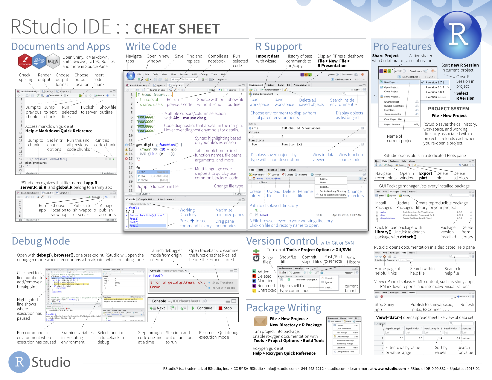

```{r setup, include=FALSE}
knitr::opts_chunk$set(echo = TRUE,
                      warning = FALSE,
                      message = FALSE)
```

```{r, echo = FALSE}
library(tidyverse)
library(sf)
library(leaflet)
```

### 1. Resources

R for Data Science:
https://r4ds.had.co.nz

R cheatsheets: https://rstudio.com/resources/cheatsheets/

Base R cheatsheet: https://rstudio.com/wp-content/uploads/2016/10/r-cheat-sheet-3.pdf

ggplot cheatsheet:
https://rstudio.com/wp-content/uploads/2015/03/ggplot2-cheatsheet.pdf

### 2. Create an R Project

https://r4ds.had.co.nz/workflow-projects.html

**8.4 RStudio projects**

R experts keep all the files associated with a project together — input data, R scripts, analytical results, figures. This is such a wise and common practice that RStudio has built-in support for this via projects.

Let’s make a project for you to use while you’re working through the rest of this book. Click File > New Project, then:

{width=500px}

A project is an entity that contains:

- It's own set of data
- It's own set of analyses
- It's own set of unique products (figures, documents, etc.)

Create a new project every time you start a new project

- Give it a unique name that is informative
- Make sure it is going into the right subdirectory

### 3. R Studio

A quick orientation to your R studio windows:


A more detailed orientation to R Studio:



### 4. R script

You should create a new R Script every time you are working on a new task within your project. Think about the R script as a word document that you can write in, edit, save, then open later to work on again. To open up an R script go to New File > R Script.

A new window will open up called "Untitled1"

Type this code into your R script:

```{r, eval = F}
a <- 3
b <- 4

a + b
```

What happened when you pressed enter after `a + b`? Did you get this error message: "Error: object 'a' not found"?

Why didn't it work? If you just pressed enter after each line, you just went to a new line of your code. In order for R to know what "a" and "b" are, you need to execute this code so that R knows that you are assigning the value "3" to the variable "a" and the value "4" to the variable "b." 

To execute your code, put your cursor back on the first line or highlight "a <- 3" and press command + enter (mac) or control + enter (windows). Do the same for "b <- 4" and "a + b." Now what happened? You should have gotten an output in your console that "a + b" equals 7. 


Look at your R environment. Before you executed your code, this window should have been empty but now after executing your code, you have two new variables, a and b. R will save these values in your environment for each working session, which means that later on in your code if you refer to "a" again, R will remember that "a = 3." However, if you close your R script or R project, it will not save your environment unless you tell it to. In general, it's good practice not to save any information between working sessions but rather to start fresh. There are two reasons for this. First, in your next session, you may start working in a new R script and you may want to assign "a" to a new value. Second, your code should always be 100% reproducible. For example, if you call "a + b" without first assigning "a" in this code, then you should get the error message "Error: object 'a' not found" to remind you that you need to assign "a" a value.

Sometimes you may want to clear your environment within a session, particularly if you're switching from working on one R script to another. You can do so with this command:

```{r, eval = FALSE}
remove(list = ls())
```

### 4. Data Munging

```{r, eval = F, echo = F}
#making the data for this exercise

species = c("mylu", "myse", "pesu", "myso")

bat_counts <- data.frame(species = species,
                         mean_count = c(100, 20, 50, 1000),
                         sd_count = c(10, 4, 10, 30)) %>% 
  rowwise() %>% 
  mutate(count = pmap(list(100, mean_count, sd_count), rnorm)) %>% 
  dplyr::select(-c(mean_count, sd_count)) %>% 
  unnest(count) %>% 
  group_by(species) %>% 
  mutate(site = seq(1:n()),
         count = round(count)) %>% 
  spread(species, count)


write_csv(bat_counts, "data/bat_counts.csv")

# bat_counts %>% 
#   gather(c(mylu, myse, pesu, myso), key = "species", value = "count") %>% 
#   ggplot(aes(x = count, fill = species)) +
#   geom_density()
```


A huge part of my job is what I call data munging. This is the process of taking raw unclean data and cleaning, processing, and formatting it so that it is in a more useable form. 

#### 4.1 Read in your data

For this exercise, open up a new R script. At the top, make sure you read in tidyverse:

```{r, eval = F}
library(tidyverse)
```

Now let's find some data! Your data "lives" somewhere on your computer. In order to read the data into R, we need to tell R where on your computer the data reside. Just as you would give someone directions to your address, you must also tell R the directions to your file. To find the directory to your file, you can use this command. It will pop up a window on your computer, navigate to where the file lives and press enter.
  
Find the file "bat_counts.csv" on your computer:

```{r, eval = FALSE}
file.choose()
```

Then copy this directory and paste it inside the command read_csv() 

```{r, eval = FALSE}
bat_counts <- read_csv("insert_your_file_path_here")
```

```{r, echo = FALSE}
bat_counts <- read_csv("data/bat_counts.csv")
```

Eventually you'll want to store this file in a data folder called "data" that is in your R project folder, and then you can read it in using a relative path rather than a direct path:

```{r, eval = FALSE}
bat_counts <- read_csv("data/bat_counts.csv")
```

But we will cover this in more detail in a follow-up R tutorial.

For now, let's dig into these data! To take a first look, here are some options...

Option 1: Call the data

```{r}
bat_counts
```

Option 2: See just the first 5 rows of the data

```{r}
head(bat_counts)
```

or first 10 rows

```{r}
head(bat_counts, 10)
```

or last 20 rows:

```{r}
tail(bat_counts, 20)
```


Option 3: View entire dataset in a separate window

```{r, eval = FALSE}
View(bat_counts)
```

Here's a quick checklist about what you should look at whenever you get a new dataset:

- What columns are in the dataset?
- What type of data are in each column (is it a number? a true/false value? a date? a set of character values?)
- What range of values are in each column?
- How are the data formatted?

```{r}
str(bat_counts)
```

It is probably not immediately obvious what these data contain but the file name gives it away. These are counts of four different species of hibernating bat that have all been highly impacted by white-nose syndrome:

*Myotis lucifugus* (little brown bat) = mylu

{width=250px}

*Myotis septentrionalis* (northern long-eared bat) = myse

{width=250px}

*Perimyotis subflavus* (tri-colored bat) = pesu

{width=250px}

*Myotis sodalis* (Indiana bat) = myso

{width=250px}

#### 4.2 Transforming data

When I get count data from state managers it is often in this format, which we call the "wide" data format. It is wide because instead of putting counts all in one single column, they are spread out among four columns and the column names are the name of the species. However, to plot data in R and to conduct any analyses, we need the data to be in what we call "long" format. Luckily in R, you can easily switch between wide and long format:

If switching from wide to long, we use the function `gather()` which has the following inputs:

1. A list of the columns you want to condense down into a single column. In our example, that will be the columns with the species codes: `c(mylu, myse, pesu, myso)`

2. The name of the new column that will hold the column names for the data you are gathering. In our example, the column names are the species codes and so we will name that column by specifying `key = species`.

3. The name of the new column that will hold the values for the data you are gathering. In our example, the values being gathered are counts of each bat species so we will name that column by specifying `value = count`.

Here is the code:

```{r}
bat_counts_long <- bat_counts %>% 
  gather(c(mylu, myse, pesu, myso), key = "species", value = "count")

bat_counts_long
```


Now to switch from long to wide, we use the function `spread` which has the following inputs:

1. The name of the column that holds names of the new columns after spreading the data. In our example, we will go back to the original wide format of the data where the species codes were the column names. We do that by specifying `key = species`.

2. The name of the column that holds the values that will populate the new spread columns. In our example, the bat counts populated the data associated with each species code. We do this by specifying `value = count`.

```{r}
bat_counts_long %>% 
  spread(key = species, value = count)
```


#### 4.3 Other data munging tools

Add a new column:

```{r}
bat_counts_long %>% 
  mutate(age = "adult")
```

Filter data:

```{r}
bat_counts_long %>% 
  filter(species == "mylu")
```

Select specific columns:

```{r}
bat_counts_long %>% 
  select(species, count)
```

Summarize the data:

```{r}
bat_counts_long %>% 
  group_by(species) %>% 
  summarise(mean_count = mean(count),
            sd_count = sd(count))
```

For more on data munging, see chapter 5 in the R for Data Science book: https://r4ds.had.co.nz/transform.html

#### 4.4 Joining datasets

I'll provide a short, quick example of how we can join datasets, but there's a number of ways to join datasets and this goes beyond the scope of this intro session. You can check out more here: https://r4ds.had.co.nz/relational-data.html


```{r, eval = F, echo = F}
bat_sites <- data.frame(site = seq(1:100)) %>% 
  rowwise() %>% 
  mutate(temperature = rnorm(mean = 10, sd = 2, n = 1))

write_csv(bat_sites, "data/bat_sites.csv")
```

Let's imagine we have temperature data for each cave or as it is called in our dataset, "site," and we want to merge this with our count data.

First read in the bat_sites.csv data:

```{r}
bat_sites <- read_csv("data/bat_sites.csv")
```

Take a quick look at this dataset. What is in it?

```{r}
bat_sites
```


Now let's merge it with our bat counts:

```{r}
bat_together <- full_join(bat_counts, bat_sites)

bat_together
```

You can see that using the function `full_join` we were able to join our bat counts together with our site data. How did R know how to join these two datasets together? It recognized that there was a common column name in both these datasets - "site" - and used that column to join the count data with the temperature data for each site. You can also specify what column you want R to join the datasets:

```{r}
bat_together <- full_join(bat_counts, bat_sites, by = c("site"))
```

And if you happened to name the column different names in each dataset, don't worry, you can specify that too. I won't go over it now, but if there is opportunity we can go over it in a future follow-up R session. You can also check it out in that link above.

### 5. Plotting

Okay, now let's do something fun. Let's make a plot!!!

You can start a new R script if you want. If you do, make sure to read in tidyverse at the top of your code:

```{r, eval = F}
library(tidyverse)
```


First we need some data. R has a number of datasets already loaded that you can access. You can find a description of them here: https://stat.ethz.ch/R-manual/R-devel/library/datasets/html/00Index.html

A really popular dataset is called "iris" and contains measurements on flower sepal length, sepal width, petal length, and petal width for several species of flower.

Let's take a quick look at these data using one of the functions to explore the data that I introduced above. What can you tell me about the iris dataset?

```{r}
str(iris)
```


#### Scatter plot

Let's say we want to look at how sepal length is related to sepal width

```{r}
iris %>% 
  ggplot(aes(x = Sepal.Length, Sepal.Width)) +
  geom_point()
```

Your plot should pop up in the Plots window. You can press Zoom to get a better view of the plot. Or click Export and save it.

We can make this figure more complex:

```{r}
iris %>% 
  ggplot(aes(x = Sepal.Length, Sepal.Width, color = Species)) +
  geom_point()
```

We can add a fitted line if we think there is a linear relationship between sepal width and sepal length:

```{r}
iris %>% 
  ggplot(aes(x = Sepal.Length, Sepal.Width, color = Species)) +
  geom_point() +
  geom_smooth(method = "lm")
```

We can also make this figure more beautiful:

```{r}
theme_set( #theme_set will make this setting for all plots within this session
  theme_bw() + #this will make the background black and white instead of gray
  theme(panel.grid = element_blank()) #this will remove the grid lines 
  )

iris %>% 
  ggplot(aes(x = Sepal.Length, Sepal.Width, color = Species)) +
  geom_point() +
  geom_smooth(method = "lm")
```

We can also label the x and y axes:

```{r}
iris %>% 
  ggplot(aes(x = Sepal.Length, Sepal.Width, color = Species)) +
  geom_point() +
  geom_smooth(method = "lm") +
  xlab("Sepal Length (cm)") +
  ylab("Sepal Width (cm)")
```

We can also make the points bigger and adjust the shape or shading:

```{r}
iris %>% 
  ggplot(aes(x = Sepal.Length, Sepal.Width, color = Species)) +
  geom_point(size = 2, alpha = 0.5) +
  geom_smooth(method = "lm") +
   geom_smooth(method = "lm") +
  xlab("Sepal Length (cm)") +
  ylab("Sepal Width (cm)")
```

```{r}
iris %>% 
  ggplot(aes(x = Sepal.Length, Sepal.Width, color = Species)) +
  geom_point(size = 2, shape = 1) +
  geom_smooth(method = "lm") +
   geom_smooth(method = "lm") +
  xlab("Sepal Length (cm)") +
  ylab("Sepal Width (cm)")
```

Instead of noting species by color, we could can change the shape and lineytpe by species (good if you need to print the figure in black and white):

```{r}
iris %>% 
  ggplot(aes(x = Sepal.Length, Sepal.Width, shape = Species, linetype = Species)) +
  geom_point() +
  geom_smooth(method = "lm") +
   geom_smooth(method = "lm") +
  xlab("Sepal Length (cm)") +
  ylab("Sepal Width (cm)")
```


#### Bar plots

Making a bar plot is not immediately intuitive in R. First, you should know that bar plots give you the ability to plot the summary of your data unless you specify to plot the data as is. Let me show by example...

Let's say you want to plot the sample size by species (in other words, how many individuals of each species was measured in this dataset?):

```{r}
iris %>% 
  ggplot(aes(x = Species)) +
  geom_bar()
```

The figure isn't very exciting, but it's important to understand what's happening behind the scenes. Take a minute to interpret this figure. What is it telling us? And what exactly happened when we asked R to plot a bar graph with "species" on the x-axis?

The figure above tells us that there were 50 individuals for each of the 3 species in our iris dataset. When we called the ggplot + geom_bar code, what R did was it counted how many entries our data had for each Species, or in other words, how many times did setosa, versicolor, and virginica appear in our dataset. It did the math for us, and then plotted it! That's pretty cool.

What if we want to make a bar plot with something like mean sepal length by species?

First we need to do the math:

```{r}
iris %>% 
  group_by(Species) %>% 
  summarise(mean_sepal_length = mean(Sepal.Length))
```

Then we plot it:

```{r}
iris %>% 
  group_by(Species) %>% 
  summarise(mean_sepal_length = mean(Sepal.Length)) %>% 
  ggplot(aes(x = Species, y = mean_sepal_length)) +
  geom_bar(stat = "identity") 
```

Notice that now we have to specify a y-axis and specify inside our geom_bar call that the statistic ("stat") to use is the actual number in that column ("identity"). 

Notice also that I first had to summarize the data iris to produce a mean value for sepal length (mean_sepal_length) and then I piped it into the plotting function. I could also have done this:

```{r}
iris_mean_sl <- iris %>% 
  group_by(Species) %>% 
  summarise(mean_sepal_length = mean(Sepal.Length)) 

iris_mean_sl %>% 
  ggplot(aes(x = Species, y = mean_sepal_length)) +
  geom_bar(stat = "identity") 
```

How do the two variations of the code differ and what is the advantage to doing one over the other?

We could leave this lesson on bar plots here, but that would be unsafitisfying beccause we are missing a CRITICAL component to the figure above. Can anyone guess what that is???

One should NEVER show a mean value with showing the variability around that mean. Write it down, tattoo on your arm, use it as your daily mantra!

Here is our complete figure with mean and standard error bars. I have also added a couple stylistic elements - I changed the alpha (shdaing) on the fill of the bars to 0.5, which makes it look nicer, and I adjusted the width of the upper and lower bars on the errorbar to 0.1. You can play with both these values to see how it changes the aesthetics of your figure:

```{r}
iris %>% 
  group_by(Species) %>% 
  summarise(mean_sepal_length = mean(Sepal.Length),
            sd_sepal_length = sd(Sepal.Length), 
            n = n(),
            se_sepal_length = sd_sepal_length/sqrt(n)) %>% 
  ggplot() +
  geom_bar(aes(x = Species, y = mean_sepal_length), 
           stat = "identity",
           alpha = 0.5) + 
  geom_errorbar(aes(x = Species, 
                    ymin = mean_sepal_length - se_sepal_length, 
                    ymax = mean_sepal_length + se_sepal_length),
                width = 0.1) + #width adjusts the width of the upper and lower bars of the errorbar
  ylab("Mean Sepal Length (cm)")
```


### 6. Mapping!

There were some people interested in mapping. Mapping is becoming more accessible in R. Many people still use ArcGIS and while it can do a lot, R is quickly catching up AND one of the benefits to using R is that it is open source software, meaning you don't have to pay for it and that anyone can write a package to add to mapping/spatial functionality in R, so it is constantly evolving new capabilities!

You can start a new R script and then make sure to specify what libraries you'll be using at the top of our code:

```{r, eval = F}
library(tidyverse)
library(sf)
library(leaflet)
```

Now look for and read in the file "ddcsp_scholars_2020.csv":

```{r, echo = FALSE}
scholar_locations <- read_csv("data/ddcsp_scholars_2020.csv")
```

Let's take a quick look at these data:

```{r}
scholar_locations
```

Let's map our locations! There are several ways to do this in R, but this one is my favorite.

First we will use functions from package sf to turn our dataset into a spatial features dataframe:

```{r}
scholar_locations_sf <- st_as_sf(scholar_locations, coords = c("longitude", "latitude"), crs = 4326)
```

Then we map it, and check it out, you can move the map and zoom in and out!

```{r}
scholar_locations_sf %>% 
  leaflet() %>% 
  addTiles() %>% 
  addCircleMarkers()
```

We can refine this map to make it prettier by setting the view (setView) to center the map and to change the underlying map layer:

```{r}
scholar_locations_sf %>% 
  leaflet() %>% 
  setView(lng = -100, lat = 40, zoom = 3) %>% 
  addProviderTiles(providers$Stamen.Watercolor) %>% 
  addCircleMarkers()
```


You can take a look at all the different types of basemaps available and switch them out with providers$Stamen.Watercolor: https://leaflet-extras.github.io/leaflet-providers/preview/

We could also label the circles to see who is where:

```{r}
scholar_locations_sf %>% 
  leaflet() %>% 
  setView(lng = -100, lat = 40, zoom = 3) %>% 
  addProviderTiles(providers$Stamen.Watercolor) %>% 
  addCircleMarkers(label = ~name)
```

We could look at who is where and what university they are at:

```{r}
scholar_locations_sf %>% 
  leaflet() %>% 
  setView(lng = -100, lat = 40, zoom = 3) %>% 
  addProviderTiles(providers$Stamen.Watercolor) %>% 
  addCircleMarkers(label = ~paste(name, university, sep = "; "))
```

We have a problem with a number of scholars that are going to the same school. This part is pretty fancy but actually not that difficult to implement. We can cluster points with two more lines of code:

```{r}
scholar_locations_sf %>% 
  leaflet() %>% 
  setView(lng = -100, lat = 40, zoom = 3) %>% 
  addProviderTiles(providers$Stamen.Watercolor) %>% 
  addCircleMarkers(label = ~paste(name, university, sep = "; "),
                   group = ~university, #this tells leaflet what column to cluster by
                   clusterOptions = markerClusterOptions(removeOutsideVisibleBounds = F)) #this clusters the points
```


Where is Abe? Let's add Abe to the map. We can do this without including him in the scholar_locations data:

```{r}
scholar_locations_sf %>% 
  leaflet() %>% 
  setView(lng = -100, lat = 40, zoom = 3) %>% 
  addProviderTiles(providers$Stamen.Watercolor) %>% 
  addCircleMarkers(lng = -121.9692444, lat = 36.9747237, label = "Abe!") %>% 
  addCircleMarkers(label = ~paste(name, university, sep = "; "),
                   group = ~university, #this tells leaflet what column to cluster by
                   clusterOptions = markerClusterOptions(removeOutsideVisibleBounds = F)) #this clusters the points
```


### 7. Help!

There is nothing more frustrating than getting an error message in R! How to decode this cryptic message? Here are a few pointers:

1. Type ?function_name in the console and press enter. For example, if I want to know more about the function `mean`, I would type, `?mean` in the console and it will bring up the documentation page in the Help file.

```{r}
?mean
```

2. Some functions come with examples. You can access this by typing `example(function_name)` in the console. For example, to find examples for the function `mean`, I would type:

```{r}
example(mean)
```

3. Google it. Copy-paste the error code and google it. You'll likely come up with some threads on stack overflow with a similar problem to what you came up with and some answers. Sometimes they help, sometimes they don't. It just depends.

4. Ask for help. Throughout this course (and beyond) I am always down to help sleuth R errors. Whether you send me a question or decide to post it online, make sure you provide a reproducible example. A reproducible example includes: required packages, data (or example data), and code.

5. Sleuth it yourself. You'd be surprised how many error messages you can sleuth on your own, but like a language, it takes time to really understand what's going on behind the scenes with R. To sleuth code, start by examining all the parts to your code. If it's just a single function, what inputs did you include? Did any of the inputs break requirements of the function (e.g. you tried to calculate the mean of a column that didn't contain any numbers)? If you're running code that pipes through a number of functions, run your code line by line until you get the error message. Oftentimes the error message will give you a hint about what is wrong. It takes some time to get to understand the language of this, but over time, you will get it!

And when in doubt, ask for help! Reach me at tinazilla@gmail.com.

### 8. General R conventions

1. List all the libraries you will need to run your code at the top of your code.

2. Follow the tidyverse style guide (https://style.tidyverse.org/index.html)

Naming:
  - short but informative
  - use lowercase as much as you can
  - never use a space or period (.) to separate words; you can use "_" (tree_data) or camelcase (treeData)
  - whatever you use, be consistent and don't mix naming conventions (don't do: tree_Data)
  
Coding:
  - use spaces between words/commands and enter new lines to keep your code clean
  - make comments using # to help you remember what you did
  
3. Never copy-paste code. Write it out so that you can learn it. Try to understand all the parts of the function. 

### 9. Reinforce your understanding

**1. Explore this page with built-in datasets in R:** https://stat.ethz.ch/R-manual/R-devel/library/datasets/html/00Index.html

**2. Pick a dataset and read it into R**

**3. What can you tell me about this dataset?** Use the commands from the first part of section 4 (plotting) to take a quick peak at the data and describe what is in it.

**4. Try out some data munging** Try switching your data from wide to long or long to wide. Add a new column. Filter for a variable. Select certain columns. Summarise the data.

**5. Make a simple plot!** Identify what variables you are interested in looking at. What's your independent variable (on the x-axis) and what is your dependent or response variable (on the y-axis)? 

**6. Introduce a third variable.** If you want to look at how x & y vary by another variable (in our plotting example, that was species), how could you visualize that? What type of aesthetic (color of the point or fill of the bar, shape of the point, etc.) would you change?

**7. Make a map.** Grab some coordinates from google map (you can find the lat/long in the address bar) and make a map of your choosing!
